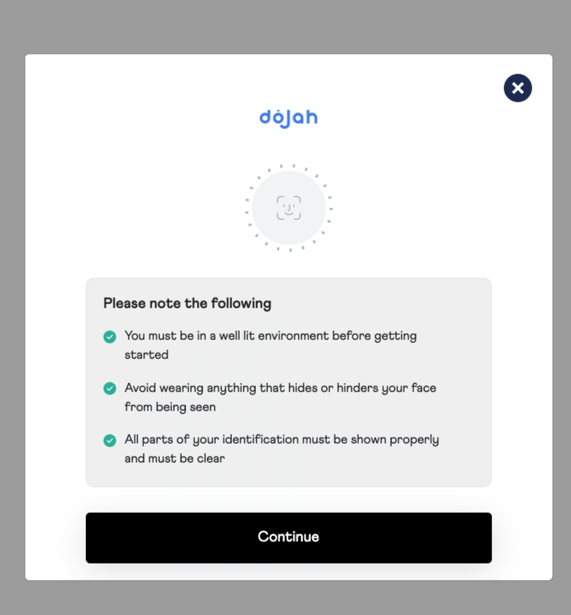

## Features [KYC AND FINANCIAL WIDGET]




## Installation

First, add flutter_dojah_kyc as a dependency in your `pubspec.yaml` file.

### iOS
Add the following keys to your Info.plist file, located in `<project root>/ios/Runner/Info.plist`:

- `NSCameraUsageDescription` - describe why your app needs access to the camera. This is called Privacy - Camera Usage Description in the visual editor.

- `NSMicrophoneUsageDescription` - describe why your app needs access to the microphone, if you intend to record videos. This is called Privacy - Microphone Usage Description in the visual editor.


- `NSLocationWhenInUseUsageDescription` - describe why your app needs access to the location, if you intend to verify address/location. This is called Privacy - Location Usage Description in the visual editor.

### Podfile

  Kindly include this in Podfile set up.

  dart: PermissionGroup.camera
  `PERMISSION_CAMERA=1`,

  dart: PermissionGroup.microphone
  `PERMISSION_MICROPHONE=1`,

  dart: PermissionGroup.location
  `PERMISSION_LOCATION=1`,
  ```
  post_install do |installer|
    installer.pods_project.targets.each do |target|
      flutter_additional_ios_build_settings(target)
      target.build_configurations.each do |config|
        config.build_settings['GCC_PREPROCESSOR_DEFINITIONS'] ||= [
          '$(inherited)',

          ## dart: PermissionGroup.camera
          'PERMISSION_CAMERA=1',

          ## dart: PermissionGroup.microphone
          'PERMISSION_MICROPHONE=1',

          ## dart: PermissionGroup.location
          'PERMISSION_LOCATION=1',
        ]
      end
    end
  end
  ```


### Android
```
// Add the camera permission: 
<uses-permission android:name="android.permission.CAMERA" />
// Add the modify audio settings permission:
<uses-permission android:name="android.permission.MODIFY_AUDIO_SETTINGS" />
// Add the Internet settings permission:
<uses-permission android:name="android.permission.INTERNET"/>
// Add the Location settings permission :
<uses-permission android:name="android.permission.ACCESS_BACKGROUND_LOCATION" />
```


## Usage

TODO: Include short and useful examples for package users. Add longer examples
to `/example` folder. 

```dart
final Map<String,dynamic> config = {
  debug: true,
  otp: true, //for verification type
  selfie: true //for verification type
};


  final userData = {
          "first_name": "John",
          "last_name": "Doe",
          "dob": "1990-04-16",
          "residence_country": "Nigeria",
          "email": "abc@gmail.com"
        };


     final configObj = {
      "widget_id": "Your Widget ID"
      };


    final metaData = {
       "user_id": "81828289191919193882",
    };


 final DojahKYC _dojahKYC = DojahKYC(
    appId: appId,
    publicKey: publicKey,
    type: "custom",
    userData: userData, //Optional 
    metaData: metaData, //Optional 
    config: configObj, 
    govData: govData, //Optional 
    referenceId: referenceId //Optional  
                );


  _dojahKYC.open(context, onSuccess: (result) {
    print('$result');
  }, 
  onClose: (close) => print('Widget Closed'),
  onError: (err) {
    print('error: $err');
  });
```


## Deployment 

`REMEMBER TO CHANGE THE APP ID and PUBLIC KEY WHEN DEPLOYING TO A LIVE (PRODUCTION) ENVIRONMENT`


## Contributing

- Fork it!
- Create your feature branch: `git checkout -b feature/feature-name`
- Commit your changes: `git commit -am 'Some commit message'`
- Push to the branch: `git push origin feature/feature-name`
- Submit a pull request 😉😉


## Additional information

Contact Dojah for more options for the config object.
